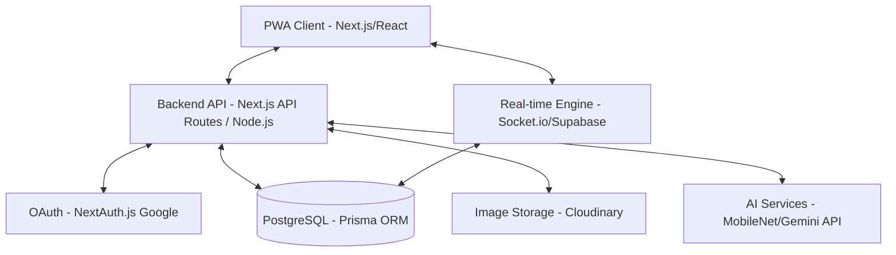

# Bazaar@IITGN Implementation Plan

Bazaar@IITGN is a high-performance PWA designed for peer-to-peer trading at IIT Gandhinagar, moving beyond fragmented WhatsApp groups to a verified, transactional platform.

## System Architecture

### Technology Stack
- **Framework**: Next.js 14+ (App Router) for SEO, SSR, and PWA capabilities.
- **Language**: TypeScript for type-safe development.
- **Styling**: CSS Modules with a custom design system for a premium aesthetic.
- **Database**: PostgreSQL with Prisma ORM (ideal for complex relationships).
- **Real-time**: Socket.io for immediate chat and offer updates.
- **Authentication**: NextAuth.js with Google OAuth restricted to `@iitgn.ac.in`.
- **Media**: Cloudinary for optimized image storage and AI-based tagging.

---

## Database Schema (Relational - PostgreSQL)

### `User` Table
- `id`: UUID (PK)
- `email`: String (Unique, @iitgn.ac.in)
- `name`: String
- `avatar`: String
- `karma_score`: Float (Default: 0)
- `hostel`: Enum (Aiyana, Beauki, Chimair, etc.)
- `wing`: String
- `contact_pref`: JSONB (WhatsApp, Phone, Chat)
- `createdAt`: DateTime

### `Listing` Table
- `id`: UUID (PK)
- `seller_id`: UUID (FK)
- `title`: String
- `description`: Text
- `category`: Enum (Electronics, Books, Cycles, Hostel Gear)
- `price`: Decimal
- `images`: String[] (Cloudinary URLs)
- `tags`: String[] (AI Generated)
- `status`: Enum (Available, Reserved, Sold)
- `is_urgent`: Boolean
- `location_hostel`: Enum
- `createdAt`: DateTime

### `Offer` Table (State Machine)
- `id`: UUID (PK)
- `buyer_id`: UUID (FK)
- `listing_id`: UUID (FK)
- `price_offered`: Decimal
- `status`: Enum (Proposed, Countered, Accepted, Declined, Completed)
- `createdAt`: DateTime

### `Chat` & `Message`
- `room_id`: UUID
- `participants`: UUID[]
- `last_message`: Text
---
- `message_id`: UUID
- `room_id`: UUID (FK)
- `sender_id`: UUID (FK)
- `content`: Text
- `timestamp`: DateTime

---

## REST & Socket API Contract

### REST API
| Endpoint | Method | Description |
| :--- | :--- | :--- |
| `/api/auth/[...nextauth]` | GET/POST | Google OAuth Handlers |
| `/api/listings` | GET | Fetch listings with filters (category, hostel, search) |
| `/api/listings` | POST | Create new listing (includes AI tagging hook) |
| `/api/listings/:id` | GET | Detailed listing view |
| `/api/offers` | POST | Propose an offer |
| `/api/offers/:id` | PATCH | Update offer status (Accept/Decline/Counter) |
| `/api/user/profile` | GET/PUT | Manage user settings and Karma |

### Socket.io Events
- `join_room`: Joins a specific transaction chat.
- `send_message`: Emits new message to room.
- `receive_message`: Client-side listener for new messages.
- `offer_updated`: broadcast status changes in the state machine.

---

## Sprint-Based Roadmap (Hackathon Schedule)

### Sprint 1: Foundation (Day 1 Morning)
- [ ] Initialize Next.js PWA with TypeScript.
- [ ] Setup PostgreSQL/Prisma connections.
- [ ] Implement Google OAuth restricted to `@iitgn.ac.in`.
- [ ] Core UI Layout (Mobile-first, Dark Mode).

### Sprint 2: The Marketplace (Day 1 Afternoon)
- [ ] Listing creation with image upload (Cloudinary).
- [ ] Smart filtering (Hostel, Category).
- [ ] Search engine logic.
- [ ] AI Service integration for automatic tagging.

### Sprint 3: The Transaction Engine (Day 1 Evening)
- [ ] Real-time Chat using Socket.io.
- [ ] Offer State Machine logic (Proposed -> Countered -> Accepted).
- [ ] Dashboard for tracking selling/buying status.

### Sprint 4: Reputation & Reliability (Day 2 Morning)
- [ ] Karma Score calculation logic.
- [ ] PWA Service Worker for offline support/notifications.
- [ ] "Verified Handshake" (QR-code or PIN-based confirmation).
- [ ] Performance optimization and Final Polish.

---

## Open Questions & Considerations
- **Handshake Verification**: Should we use QR codes for the "Verified Handshake" at pickup points?
- **Urgent UI**: How prominently should "Urgent" badges appear? (e.g., flashing or distinct colors?)
- **Karma Weighting**: What actions contribute most to Karma? (e.g., fast responses vs. successful trades)
